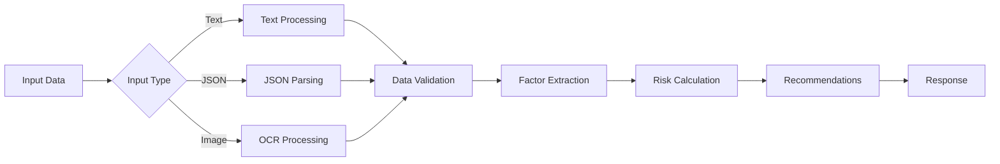

# 🏥 AI Health Risk Profiler

AI-powered health assessment service that analyzes lifestyle data from text, JSON, or images to generate personalized health risk profiles and recommendations.

## 🏗️ Architecture

```
src/
├── index.js              # Express server with middleware
├── routes.js             # API endpoints with error handling
├── ocr.js               # OCR processing with Tesseract.js
├── factors.js           # Health factor extraction logic
├── risk.js              # Risk calculation and scoring
├── recommendations.js   # AI-powered recommendations with Gemini API
├── guardrails.js        # Input validation with Joi
└── utils/
    └── logger.js        # Winston-based logging system
```

**Processing Flow Diagram:**

The system follows a modular pipeline architecture where each input type (text, JSON, or image) is processed through a common validation and analysis flow:



## 🚀 Setup Instructions

### 1. Clone & Install
```bash
git clone https://github.com/jyolx/ai-health-profiler.git
cd ai-health-profiler
npm install
```

### 2. Environment Configuration
Create `.env` file:
```env
PORT=3000
LOG_LEVEL=info
NODE_ENV=development
GEMINI_API_KEY=your_gemini_api_key_here  # Optional - uses static fallback
```

### 3. Run Application
```bash
npm run dev    # Development with auto-reload
npm start      # Production
```

## 📡 API Usage Examples

### Health Check
```bash
curl http://localhost:3000/ping
```

### Text Analysis
```bash
curl -X POST http://localhost:3000/api/analyze \
  -H "Content-Type: application/json" \
  -d '{
    "text": "Age: 35, Smoker: no, Exercise: daily, Diet: balanced, BMI: 24.2"
  }'
```

### JSON Input
```bash
curl -X POST http://localhost:3000/api/analyze \
  -H "Content-Type: application/json" \
  -d '{
    "data": {
      "age": 35,
      "smoker": false,
      "exercise": "often",
      "diet": "balanced with vegetables",
      "bmi": 24.2,
      "sleep": 7.5,
      "alcohol": "rarely"
    }
  }'
```

### Image Upload (OCR)


```bash
curl -X POST http://localhost:3000/api/analyze \
  -F "image=@trial.png"
```

## 📊 Response Format
```json
{
  "answers": {
    "age": 35,
    "smoker": false,
    "exercise": "sometimes",
    "diet": "balanced",
    "bmi": 24.2,
    "sleep": 7,
    "alcohol": "no"
  },
  "missing_fields": [],
  "confidence": 0.9,
  "factors": [],
  "risk_level": "low",
  "score": 0,
  "rationale": [],
  "recommendations": [
    "Engage in at least 150 minutes of moderate-intensity aerobic activity weekly.",
    "Incorporate a variety of colorful fruits and vegetables into your daily meals.",
    "Prioritize 7-9 hours of quality sleep each night."
  ],
  "source": "gemini-ai",
  "status": "ok"
}
```

## ⚡ Error Handling Examples

### 1. Incorrect JSON Format
```json
{
  "status": "error",
  "type": "invalid_json",
  "message": "Invalid JSON format in request body. Please check your JSON syntax."
}
```

### 2. Invalid File Type
```json
{
  "status": "error",
  "type": "file_validation_error",
  "message": "Invalid file type: application/pdf. Only image files are allowed."
}
```

### 3. Low OCR Confidence
```json
{
  "status": "low_confidence",
  "reason": "OCR confidence too low",
  "confidence": 0.25
}
```

### 4. Invalid Field Values
```json
{
  "status": "invalid_data",
  "reason": "age must be less than or equal to 120",
  "field": "age"
}
```

### 5. Unknown Fields
```json
{
  "status": "invalid_data",
  "reason": "rain is not allowed",
  "field": "rain"
}
```

## 🎯 Key Features

- **Multi-Input Support**: Text, JSON, and image processing
- **OCR Integration**: Tesseract.js for image text extraction
- **Risk Assessment**: 0-100 scoring with low/medium/high categories
- **File Upload Handling**: Multer middleware for secure image uploads with validation
- **Data Validation**: Joi schema validation for robust input sanitization
- **AI Recommendations**: Google Gemini API with static fallback
- **Comprehensive Logging**: Winston with module-specific loggers
- **Error Handling**: Robust validation and graceful degradation

## 🚀 Live Deployment

**Azure App Service**: [https://aimedicalprofiler-hfcnbmhkdahdcjed.centralindia-01.azurewebsites.net](https://aimedicalprofiler-hfcnbmhkdahdcjed.centralindia-01.azurewebsites.net)

**API Base**: `https://aimedicalprofiler-hfcnbmhkdahdcjed.centralindia-01.azurewebsites.net/api`

## ⚠️ Important Notes

- 🏥 **Medical Disclaimer**: All recommendations are for informational purposes only and not a substitute for professional medical advice
- 🔒 **Privacy**: No user data is stored permanently; all processing is stateless
- 📊 **Accuracy**: OCR confidence scores help assess data reliability
- 🛡️ **Security**: Input validation prevents malicious data injection
- ⚡ **Performance**: File size limits and request validation ensure service stability

---

*Built with Node.js, Express, Tesseract.js, Google Gemini AI, and deployed on Microsoft Azure*

