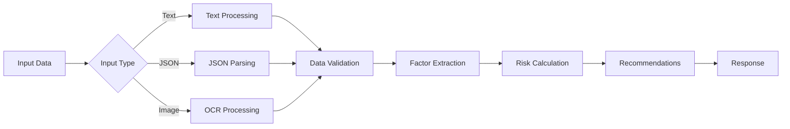

# 🏥 AI Health Risk Profiler

A comprehensive **AI-powered health assessment service** that analyzes lifestyle data from text, JSON, or scanned images to generate personalized health risk profiles and evidence-based recommendations.

## ✨ Features

### 🔍 **Multi-Input Processing**
- **Text Analysis**: Process natural language health descriptions
- **OCR Support**: Extract data from scanned health forms and documents
- **JSON Input**: Accept structured health data
- **Image Processing**: Analyze uploaded health documents (max 10MB)

### 🧠 **Intelligent Analysis**
- **Risk Factor Extraction**: Identify health risk factors from lifestyle data
- **Risk Scoring**: Calculate comprehensive risk scores (0-100 scale)  
- **AI-Powered Recommendations**: Generate personalized recommendations using Google Gemini AI with static fallback
- **Confidence Metrics**: Assess data quality and processing confidence
- **Smart Validation**: Robust input validation with detailed error handling

### 📋 **Comprehensive Logging**
- **Module-Specific Logging**: Track activity across different components
- **Multiple Log Levels**: Support for debug, info, warn, and error levels
- **Dual Output**: Console display and file logging with human-readable format
- **Request Tracking**: Log all API requests with metadata

### 🛡️ **Enhanced Error Handling**
- **File Validation**: Prevent non-image uploads and oversized files
- **JSON Parsing**: Graceful handling of malformed JSON requests
- **Graceful Degradation**: Fallback mechanisms for service reliability
- **Detailed Error Responses**: Clear, actionable error messages

## 🏗️ Architecture

```
src/
├── index.js              # Express server with middleware
├── routes.js             # API endpoints with error handling
├── ocr.js               # OCR processing with Tesseract.js
├── factors.js           # Health factor extraction logic
├── risk.js              # Risk calculation and scoring
├── recommendations.js   # AI-powered recommendations with Gemini API
├── guardrails.js        # Input validation with Joi
└── utils/
    └── logger.js        # Winston-based logging system
```

## 🚀 Installation & Setup

### 1. **Clone Repository**
```bash
git clone https://github.com/jyolx/ai-health-profiler.git
cd AI_health_profiler
```

### 2. **Install Dependencies**
```bash
npm install
```

### 3. **Environment Configuration**
Create a `.env` file:
```env
# Server Configuration
PORT=3000

# Logging Configuration  
LOG_LEVEL=info

# Node Environment
NODE_ENV=development

# AI Configuration (Optional - falls back to static recommendations if not provided)
GEMINI_API_KEY=your_gemini_api_key_here
```

### 4. **Start Development Server**
```bash
# Development mode with auto-restart
npm run dev

# Production mode
npm start
```

### 5. **Access Application**
- **API Base URL**: `http://localhost:3000/api`
- **Health Check**: `http://localhost:3000/ping`

## 📡 API Endpoints

### 🔬 **Health Risk Analysis**
**POST** `/api/analyze`

Comprehensive health risk analysis with multiple input options.

#### **Text Input Example:**
```bash
curl -X POST http://localhost:3000/api/analyze \
  -H "Content-Type: application/json" \
  -d '{
    "text": "Age: 42, Smoker: yes, Exercise: rarely, Diet: high sugar and processed foods, BMI: 28.5, Sleep: 5 hours, Alcohol: often"
  }'
```

#### **Structured JSON Example:**
```bash
curl -X POST http://localhost:3000/api/analyze \
  -H "Content-Type: application/json" \
  -d '{
    "data": {
      "age": 35,
      "smoker": false,
      "exercise": "often",
      "diet": "balanced with vegetables",
      "bmi": 24.2,
      "sleep": 7.5,
      "alcohol": "rarely"
    }
  }'
```

#### **Image Upload Example:**
```bash
curl -X POST http://localhost:3000/api/analyze \
  -F "image=@health_survey.jpg" \
  http://localhost:3000/api/analyze
```

#### **Expected Response:**
```json
{
  "answers": {
    "age": 42,
    "smoker": true,
    "exercise": "rarely",
    "diet": "high sugar and processed foods",
    "bmi": 28.5,
    "sleep": 5,
    "alcohol": "often"
  },
  "missing_fields": [],
  "confidence": 0.88,
  "factors": ["smoking", "poor diet", "low exercise", "overweight", "poor sleep", "alcohol consumption"],
  "risk_level": "high",
  "score": 85,
  "rationale": ["smoking", "poor diet", "low exercise"],
  "recommendations": [
    "Quit smoking with professional support",
    "Reduce processed foods and increase fruits, vegetables, and whole grains", 
    "Start with 30 minutes of moderate exercise 3 times per week",
    "Consult healthcare provider for comprehensive health assessment immediately",
    "Practice stress management techniques"
  ],
  "source": "gemini-ai",
  "status": "ok"
}
```

### 🔍 **OCR Processing Only**
**POST** `/api/ocr`

Extract and analyze text from images without full risk analysis.

```bash
curl -X POST http://localhost:3000/api/ocr \
  -F "image=@health_form.png" \
  http://localhost:3000/api/ocr
```

### ❤️ **Health Check**
**GET** `/ping`

Service status and configuration information.

```bash
curl http://localhost:3000/ping
```

**Response:**
```json
{
  "status": "ok",
  "timestamp": "2025-09-27T20:30:00.000Z"
}
```

## ⚡ Error Handling & Validation

### **File Upload Errors**

#### **Invalid File Type:**
```json
{
  "status": "error",
  "type": "file_validation_error",
  "message": "Invalid file type: application/pdf. Only image files are allowed."
}
```

#### **File Size Exceeded:**
```json
{
  "status": "error", 
  "type": "upload_error",
  "message": "File size too large. Maximum allowed size is 10MB.",
  "code": "LIMIT_FILE_SIZE"
}
```

### **JSON Parsing Errors**

#### **Malformed JSON:**
```json
{
  "status": "error",
  "type": "invalid_json",
  "message": "Invalid JSON format in request body. Please check your JSON syntax."
}
```

### **Data Validation Errors**

#### **Incomplete Profile:**
```json
{
  "status": "incomplete_profile",
  "reason": ">50% fields missing",
  "missing_fields": ["age", "smoker", "diet"],
  "confidence": 0.35
}
```

#### **Low OCR Confidence:**
```json
{
  "status": "low_confidence", 
  "reason": "OCR confidence too low",
  "confidence": 0.25
}
```

#### **Invalid Field Values:**
```json
{
  "status": "invalid_data",
  "reason": "age must be less than or equal to 120",
  "field": "age"
}
```

## 🔄 Data Processing Pipeline



### **Processing Steps:**
1. **Input Processing** → Handle text, JSON, or image inputs
2. **Data Extraction** → Parse health information from various formats
3. **Validation** → Check completeness, confidence, and data quality
4. **Factor Analysis** → Identify specific health risk factors
5. **Risk Scoring** → Calculate numerical risk score and categorization
6. **AI Recommendations** → Generate personalized health advice using Gemini AI (with static fallback)

## 📊 Supported Health Data Fields

| Field | Type | Range | Required | Description |
|-------|------|-------|----------|-------------|
| `age` | Integer | 1-120 | ✅ | Person's age in years |
| `smoker` | Boolean | true/false | ✅ | Smoking status |
| `exercise` | String | never/rarely/sometimes/often/daily | ✅ | Exercise frequency |
| `diet` | String | Descriptive text | ✅ | Dietary habits description |
| `bmi` | Float | 10.0-50.0 | ❌ | Body Mass Index |
| `sleep` | Float | 0-24 | ❌ | Hours of sleep per night |
| `alcohol` | String/Boolean | never/rarely/sometimes/often | ❌ | Alcohol consumption |

## 🎯 Risk Assessment System

### **Risk Levels:**
- 🟢 **Low Risk**: 0-30 points
- 🟡 **Medium Risk**: 31-60 points  
- 🔴 **High Risk**: 61-100 points

### **Risk Factor Weights:**
| Factor | Points | Criteria |
|--------|--------|----------|
| Smoking | 25 | Current smoker |
| Obesity | 20 | BMI ≥ 30 |
| Poor Diet | 15 | High sugar/processed foods |
| Low Exercise | 15 | Never/rarely exercises |
| Advanced Age | 15 | Age ≥ 65 |
| High Fat Intake | 12 | High fat/fried foods |
| Underweight | 12 | BMI < 18.5 |
| Overweight | 10 | BMI 25-29.9 |
| Poor Sleep | 10 | < 6 or > 9 hours |
| Alcohol | 8 | Often/sometimes drinks |

### **Age Adjustment:**
Additional 2 points per 5-year increment above age 50.

## 🤖 AI-Powered Recommendations System

### **Google Gemini Integration:**
The application uses **Google Gemini AI** to generate personalized health recommendations based on risk factors and health profile data.

#### **How it Works:**
1. **AI Analysis**: Sends risk level and identified health factors to Gemini AI
2. **Personalized Recommendations**: Receives <5 tailored, actionable health recommendations
3. **Fallback System**: Automatically uses static recommendations if AI is unavailable
4. **Quality Assurance**: All recommendations are medically sound and specific to user's profile

#### **AI vs Static Recommendations:**
- **With Gemini AI** (`source: "gemini-ai"`): Dynamic, contextual, and highly personalized
- **Static Fallback** (`source: "static"`): Reliable, pre-defined recommendations based on factors

#### **Response Format:**
```json
{
  "recommendations": [
    "Quit smoking immediately and consider nicotine replacement therapy",
    "Implement a structured exercise program starting with 20 minutes daily",
    "Schedule comprehensive health screening with your physician within 2 weeks",
    "Adopt Mediterranean diet focusing on lean proteins and whole grains",
    "Practice stress reduction through mindfulness meditation or yoga"
  ],
  "source": "gemini-ai"
}
```

## 📝 Logging & Monitoring

### **Log Levels:**
- `debug`: Detailed diagnostic information
- `info`: General operational messages  
- `warn`: Warning conditions
- `error`: Error conditions requiring attention

### **Log Locations:**
- **Console**: Colorized, real-time output during development
- **File**: `logs/app.log` with structured, persistent logging

### **Sample Log Output:**
```
2025-09-27 20:30:00 [info][server]: 🚀 Health Risk Profiler server running on port 3000
2025-09-27 20:30:05 [info][routes]: Starting health risk analysis {"hasFile":true,"hasTextData":false}
2025-09-27 20:30:05 [info][ocr]: Starting health profile processing {"inputType":"image","inputSize":245760}
2025-09-27 20:30:06 [info][factors]: Starting factor extraction {"inputFields":["age","smoker","exercise"],"dataPointsCount":3}
2025-09-27 20:30:06 [info][risk]: Starting risk calculation {"factorsCount":2,"factors":["smoking","poor diet"],"hasAgeData":true,"age":42}
2025-09-27 20:30:06 [info][recommendations]: Starting recommendation generation {"riskLevel":"high","factorsCount":2,"factors":["smoking","poor diet"]}
```

## 🔧 Development

### **Available Scripts:**
```bash
# Development with auto-reload
npm run dev

# Production server
npm start
```

### **Development Tools:**
- **Nodemon**: Auto-restart on file changes during development
- **Winston**: Comprehensive logging system
- **Joi**: Schema validation for robust input handling
- **Multer**: File upload handling with validation
- **Tesseract.js**: OCR processing capabilities
- **Google Gemini AI**: AI-powered personalized health recommendations
- **Microsoft Azure**: Cloud deployment platform and hosting service

## 🚀 Deployment

**Live Application**: This AI Health Profiler is deployed on Azure and can be accessed at:
**[https://your-app-name.azurewebsites.net](https://your-app-name.azurewebsites.net)**

- **Platform**: Microsoft Azure App Service
- **API Base URL**: `https://your-app-name.azurewebsites.net/api`


## 📖 Sample Test Cases

### **Low Risk Profile:**
```json
{
  "data": {
    "age": 25,
    "smoker": false,
    "exercise": "daily",
    "diet": "balanced with lots of vegetables",
    "bmi": 21.5,
    "sleep": 8,
    "alcohol": "never"
  }
}
```

### **High Risk Profile:**
```json
{
  "data": {
    "age": 68,
    "smoker": true,
    "exercise": "never", 
    "diet": "high sugar processed foods and fried meals",
    "bmi": 34.2,
    "sleep": 4,
    "alcohol": "often"
  }
}
```

### **Edge Cases:**
```json
{
  "data": {
    "age": 150,  // Should trigger validation error
    "smoker": "maybe"  // Should trigger validation error
  }
}
```

## ⚠️ Important Notes

- 🏥 **Medical Disclaimer**: All recommendations are for informational purposes only and not a substitute for professional medical advice
- 🔒 **Privacy**: No user data is stored permanently; all processing is stateless
- 📊 **Accuracy**: OCR confidence scores help assess data reliability  
- 🛡️ **Security**: Input validation prevents malicious data injection
- ⚡ **Performance**: File size limits and request validation ensure service stability
